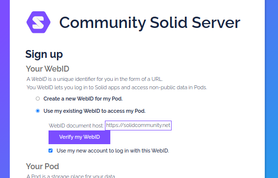

# Easy token

## Description

Easy token is a fork of the solid community server with an improvement on the registration flow.

Easy token allows verifying webids ownership by simply clicking a button instead of manually adding a verification token.

It is, for now, a full CSS fork but will become a simple CSS component that can be injected into CSS once I get a grasp of component.js dependency injection.

## Problem

When creating a new Pod with an existing WebID, CSS would ask the user to prove that their own the given WebID by adding a verification token to their WebID document. To do so, the user would do the following steps:
 1. Open a pod browser (such as Penny) in a new window
 1. Log in to the pod browser
 1. Browse to the webid document
 1. Copy past the verification token triple and add it to the WebId document ( this operation can be complicated for newcomers)

## Solution

The proposed solution is to automate the former steps with a simple button. The steps to verify the WebID are the following:
 1. click the "Proove that I own this webId" button
 1. login to your OIDC issuer


 
## Usage
```
git clone https://github.com/joeitu/easy-token.git
cd easy-token
npm ci
npm run start -- -c ./config/default-easy-token.json
```
Assuming that you already have a WebID, you can now go to the registration page `/IDP/register/` and choose the option to *Use my existing WebID to access my Pod*

Enter your OIDC provider and click the "Proove that I own this WebID" button. You should be redirected to your OIDC provider, log in with your credential, and done! Now you can finish the registration form as usual.

## TODO's
 - [ ] Clean refactore code
   - [ ] Simplify config import
 - [ ] Make a component importable with component.js
 - [ ] Verify that the token is correclty added to the webId document
 - [ ] Don't fail quietly, return error message to the user
 - [ ] remove oidcIssuerRegistrationToken after registration
   - [ ] also add oidcIssuer the webId document after registration?

*Bellow the original Solid Community Server README*

# Community Solid Server


[](https://github.com/solid/community-server/blob/main/LICENSE.md)
[](https://www.npmjs.com/package/@solid/community-server)
[](https://www.npmjs.com/package/@solid/community-server)
[](https://github.com/solid/community-server/actions)
[](https://coveralls.io/github/solid/community-server)
[](https://github.com/solid/community-server/discussions)
[](https://gitter.im/solid/community-server)

**The Community Solid Server is open software
that provides you with a [Solid](https://solidproject.org/) Pod and identity.
This Pod acts as your own personal storage space
so you can share data with people and Solid applications.**

As an open and modular implementation of the
[Solid specifications](https://solid.github.io/specification/),
the Community Solid Server is a great companion:

- 🧑🏽 **for people** who want to try out having their own Pod

- 👨🏿‍💻 **for developers** who want to create and test Solid apps

- 👩🏻‍🔬 **for researchers** who want to design new features for Solid

And, of course, for many others who like to experience Solid.

You can install the software locally or on your server
and get started with Solid immediately.


## ⚡ Running the server
To run the server, you will need [Node.js](https://nodejs.org/en/).
We support versions 12.7 and up.
<br>
If you do not use Node.js,
you can run a [Docker](https://www.docker.com/) version instead.

### 💻 Installing and running locally
After installing Node.js,
install the latest server version
from the [npm package repository](https://www.npmjs.com/):

```shell
npm install -g @solid/community-server
```

To run the server with in-memory storage, use:
```shell
community-solid-server # add parameters if needed
```

To run the server with your current folder as storage, use:
```shell
community-solid-server -c @css:config/file.json
```

### 📃 Installing and running from source
If you rather prefer to run the latest source code version,
or if you want to try a specific [branch](https://www.npmjs.com/) of the code,
you can use:
```shell
git clone https://github.com/solid/community-server.git
cd community-server
npm ci
npm start -- # add parameters if needed
```

### 📦 Running via Docker
Docker allows you to run the server without having Node.js installed:
```shell
git clone https://github.com/solid/community-server.git
cd community-server
# Build the Docker image
docker build --rm -f Dockerfile -t css:latest .
# Run the image, serving your `~/Solid` directory on `http://localhost:3000`
docker run --rm -v ~/Solid:/data -p 3000:3000 -it css:latest
# Or use one of the built-in configurations
docker run --rm -p 3000:3000 -it css:latest -c config/default.json
# Or use your own configuration mapped to the right directory
docker run --rm -v ~/solid-config:/config -p 3000:3000 -it css:latest -c /config/my-config.json
```


## 🔧 Configuring the server
The Community Solid Server is designed to be flexible
such that people can easily run different configurations.
This is useful for customizing the server with plugins,
testing applications in different setups,
or developing new parts for the server
without needing to change its base code.

### ⏱️ Parameters
An easy way to customize the server is
by passing parameters to the server command.
These parameters give you direct access
to some commonly used settings:

| parameter name         | default value              | description                                                                                                                          |
| --------------         | -------------              | -----------                                                                                                                          |
| `--port, -p`           | `3000`                     | The TCP port on which the server runs.                                                                                               |
| `--baseUrl. -b`        | `http://localhost:$PORT/`  | The public URL of your server.                                                                                                       |
| `--loggingLevel, -l`   | `info`                     | The detail level of logging; useful for debugging problems.                                                                          |
| `--config, -c`         | `@css:config/default.json` | The configuration for the server. The default only stores data in memory; to persist to your filesystem, use `@css:config/file.json` |
| `--rootFilePath, -f`   | `./`                       | Root folder of the server, when using a file-based configuration.                                                                    |
| `--sparqlEndpoint, -s` |                            | URL of the SPARQL endpoint, when using a quadstore-based configuration.                                                              |
| `--showStackTrace, -t` | false                      | Enables detailed logging on error pages.                                                                                             |
| `--podConfigJson`      | `./pod-config.json`        | Path to the file that keeps track of dynamic Pod configurations.                                                                     |
| `--mainModulePath, -m` |                            | Path from where Components.js will start its lookup when initializing configurations.

### 🧶 Custom configurations
More substantial changes to server behavior can be achieved
by writing new configuration files in JSON-LD.
The Community Solid Server uses [Components.js](https://componentsjs.readthedocs.io/en/latest/)
to specify how modules and components need to be wired together at runtime.

Examples and guidance on configurations
are available in the [`config` folder](https://github.com/solid/community-server/tree/main/config).

Recipes for configuring the server can be found at [solid/community-server-recipes](https://github.com/solid/community-server-recipes).


## 👩🏽‍💻 Developing server code
The server allows writing and plugging in custom modules
without altering its base source code.

The [📗 API documentation](https://solid.github.io/community-server/docs/) and
the [📐 architectural diagram](https://rubenverborgh.github.io/solid-server-architecture/solid-architecture-v1-3-0.pdf)
can help you find your way.

If you want to help out with server development,
have a look at the [📓 developer notes](guides/developer-notes.md) and
[🛠️ good first issues](https://github.com/solid/community-server/issues?q=is%3Aissue+is%3Aopen+label%3A%22good+first+issue%22).


## 📜 License
The Solid Community Server code
is copyrighted by [Inrupt Inc.](https://inrupt.com/)
and [imec](https://www.imec-int.com/)
and available under the [MIT License](https://github.com/solid/community-server/blob/main/LICENSE.md).

Core contributors are
[Joachim Van Herwegen](https://github.com/joachimvh),
[Ruben Verborgh](https://github.com/RubenVerborgh),
[Ruben Taelman](https://github.com/rubensworks),
and
[Matthieu Bosquet](https://github.com/matthieubosquet).


## 🎤 Feedback and questions
Don't hesitate to [start a discussion](https://github.com/solid/community-server/discussions)
or [report a bug](https://github.com/solid/community-server/issues).

Learn more about Solid at [solidproject.org](https://solidproject.org/).
